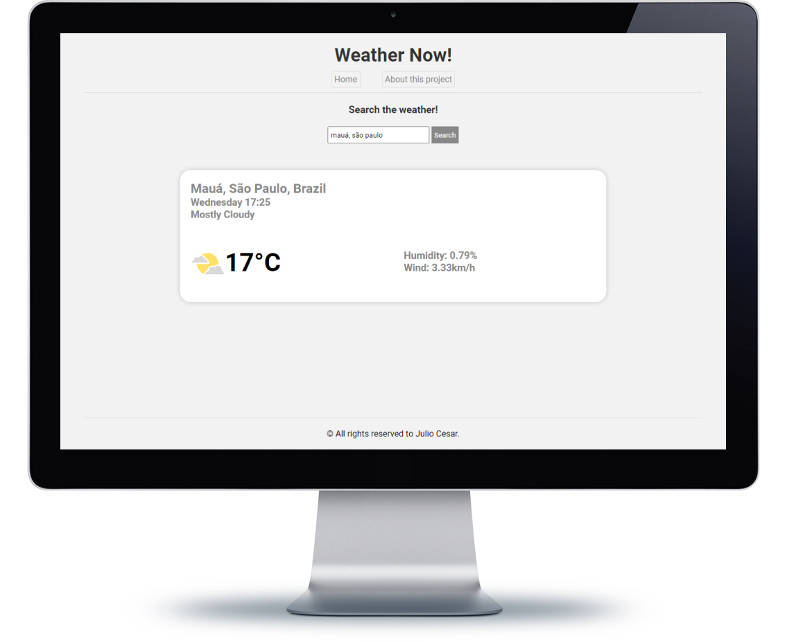

# Uma versão atualizada do app de tempo.

[clique aqui para ver o repo da primeira versão](https://github.com/juliop3p/weatherApp)

### Melhorias: Interface, Utiliza localização inicial.

#Node.js, #Handlebars, #MVC

